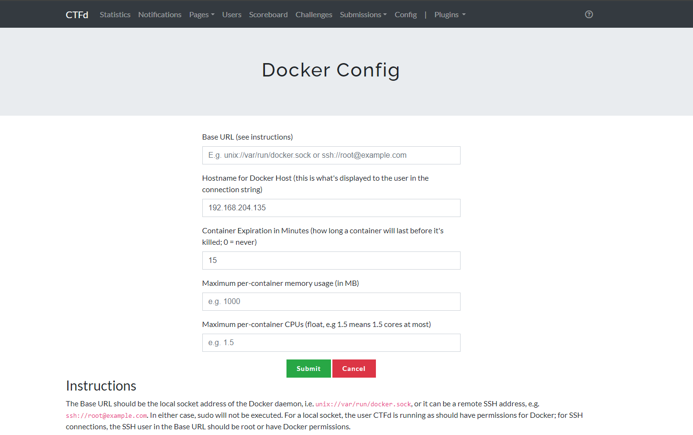
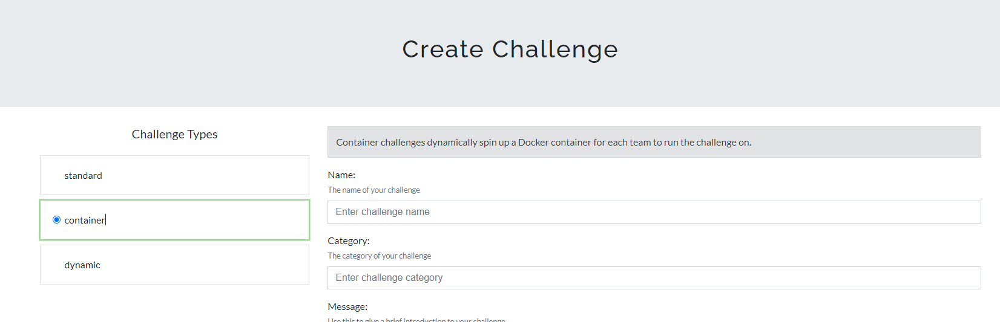
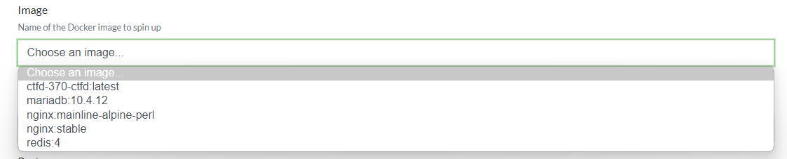
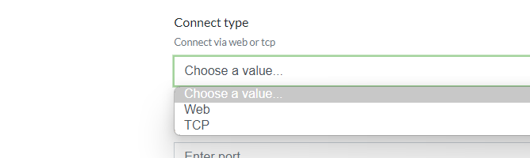
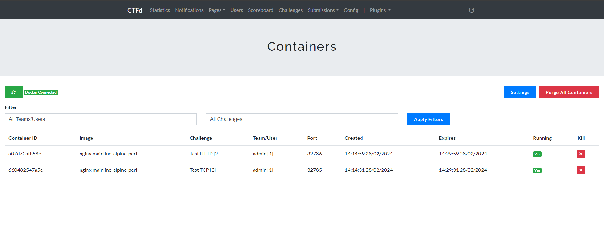
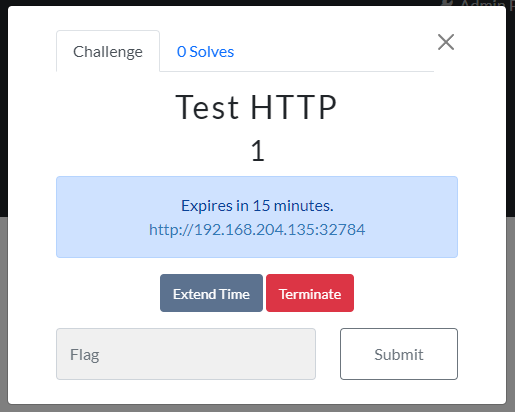
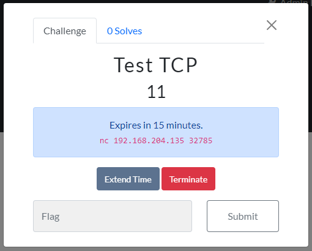
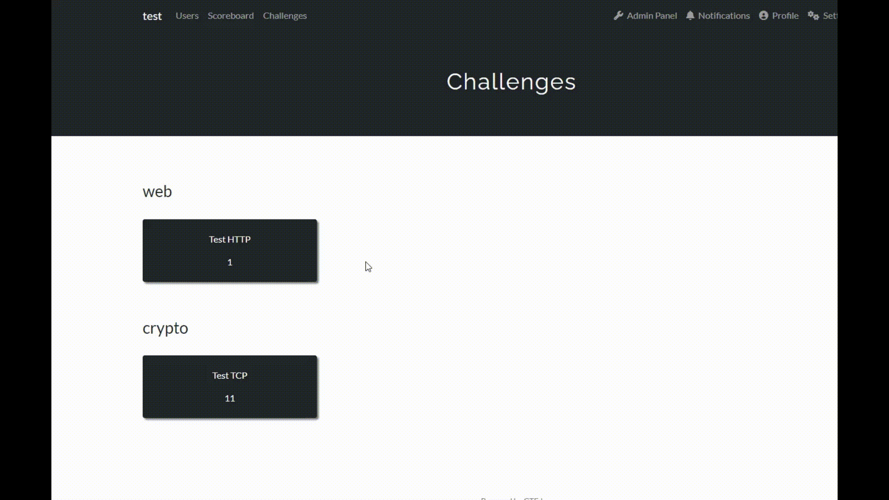

<!-- Improved compatibility of back to top link: See: https://github.com/othneildrew/Best-README-Template/pull/73 -->
<a name="readme-top"></a>
<!--
*** Thanks for checking out the Best-README-Template. If you have a suggestion
*** that would make this better, please fork the repo and create a pull request
*** or simply open an issue with the tag "enhancement".
*** Don't forget to give the project a star!
*** Thanks again! Now go create something AMAZING! :D
-->


<!-- PROJECT SHIELDS -->
<!--
*** I'm using markdown "reference style" links for readability.
*** Reference links are enclosed in brackets [ ] instead of parentheses ( ).
*** See the bottom of this document for the declaration of the reference variables
*** for contributors-url, forks-url, etc. This is an optional, concise syntax you may use.
*** https://www.markdownguide.org/basic-syntax/#reference-style-links
-->

<!-- PROJECT LOGO -->
<br />
<div align="center">

  <h3 align="center">CTFd Docker Containers Plugin</h3>
  <p align="center">
    A plugin that can create containerize challenges for your CTF contest 
    <br />
  </p>
</div>


<!-- TABLE OF CONTENTS -->
<details>
  <summary>Table of Contents</summary>
  <ol>
    <li>
      <a href="#getting-started">Getting Started</a>
      <ul>
        <li><a href="#prerequisites">Prerequisites</a></li>
        <li><a href="#installation">Installation</a></li>
      </ul>
    </li>
    <li><a href="#usage">Usage</a></li>
    <li><a href="#demo">Demo</a></li>
    <li><a href="#roadmap">Roadmap</a></li>
    <li><a href="#license">License</a></li>
    <li><a href="#contact">Contact</a></li>
  </ol>
</details>


<!-- GETTING STARTED -->
## Getting Started

This is an example of how you may give instructions on setting up your project locally.
To get a local copy up and running follow these simple example steps.

### Prerequisites

To use this plugin you'll need  

- Know how to host CTFd w Docker
- Know how to use Docker

### Installation


1. Map docker socket into CTFd container by modifying the `docker-compose.yml` file:
   ```docker
    services:
      ctfd:
        ...
        volumes:
        ...
          - /var/run/docker.sock:/var/run/docker.sock
        ...
   ```
2. Clone this repository

3. Rename "CTFd-Docker-Plugin" to "containers"

4. Place `containers` folder inside `CTFd/plugins` directory

<p align="right">(<a href="#readme-top">back to top</a>)</p>


<!-- USAGE EXAMPLES -->
## Usage

1. Connect to Docker daemon:

    If the CTFd and the challenges host in the same machine, you just need to go to the plugin settings page `/containers/settings` and fill in everything you need except the `Base URL` field.  

    

    If you host the CTFd and the challenges in different machines, you need to follow the instructions one that page **I dont think its working XD, I'll try to fix that later**

2. Create the challenge:
    - Select `container` type and fill all the required fields

    

    - If you want regular scoring for the challenge, set the maximum and minimum values to the same amount and the decay to zero.

    - In the image field, it allows you to select the docker image already on the machine

    

    - In the `Connect type` field, it allows you to choose how to connect to the challenge such as via web or tcp

    

<p align="right">(<a href="#readme-top">back to top</a>)</p>

## Demo

Admin can manage created containers, containers can also be filtered by challenge or player



**Challenge view**
Web             |  TCP
:-------------------------:|:-------------------------:
 |  




<p align="right">(<a href="#readme-top">back to top</a>)</p>

<!-- ROADMAP -->
## Roadmap

- [x] Make the plugin work in user mode
- [x] Make the admin dashboard can filter by team/user or challenge
- [x] Make the plugin work with core-beta theme


See the [open issues](https://github.com/othneildrew/Best-README-Template/issues) for a full list of proposed features (and known issues).

<p align="right">(<a href="#readme-top">back to top</a>)</p>


<!-- LICENSE -->
## License

Distributed under the MIT License. See `LICENSE.txt` for more information.

Actually, this is just an upgrade of [andyjsmith's plugin](https://github.com/andyjsmith/CTFd-Docker-Plugin) that I upgraded by myself. I haven't worked much with the Licenses on github so it might be a violation. If you have anything please contact me by email below, I will respond within 2 days!

Thanks again [andyjsmith](https://github.com/andyjsmith) for creating this base plugin!

<p align="right">(<a href="#readme-top">back to top</a>)</p>


<!-- CONTACT -->
## Contact

Phan Nhat - @Discord ftpotato - contact@phannhat.id.vn

Project Link: [https://github.com/phannhat17/CTFd-Docker-Plugin](https://github.com/phannhat17/CTFd-Docker-Plugin)

<p align="right">(<a href="#readme-top">back to top</a>)</p>
